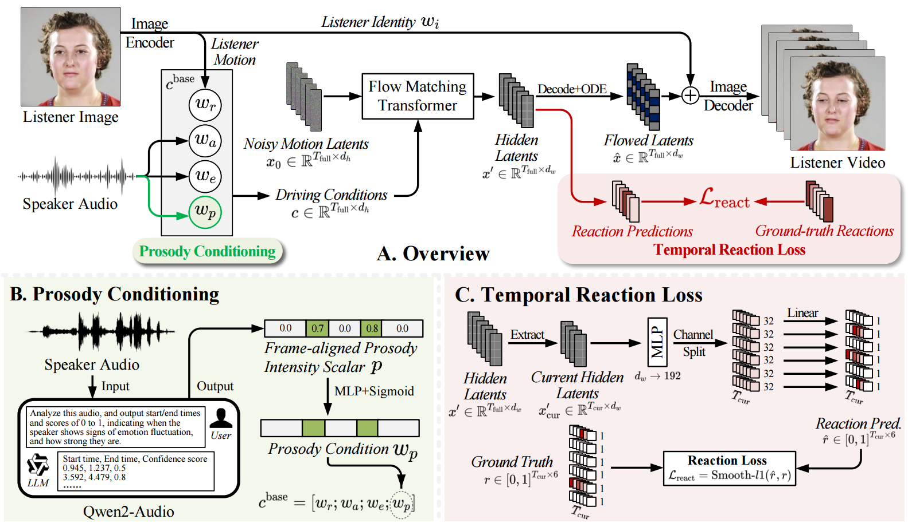

# GLARE: Generating Listening Heads with Appropriate Reactions

PyTorch implementation of **GLARE: Generating Listening Heads with Appropriate Reactions**.



---

## Repository Structure

```text
.
├── train.py
├── train_multigpu.py
├── generate.py
├── requirements_glare.txt
├── README_train_multigpu.md
│
├── float/
│   ├── data/
│   │   ├── VideoDataset.py
│   │   ├── dataset.py
│   │   └── ...
│   ├── models/
│   │   ├── FLOAT.py
│   │   ├── FMT.py
│   │   ├── generator.py
│   │   ├── intensity_encoder.py
│   │   ├── wav2vec2.py
│   │   └── wav2vec2_ser.py
│   └── options/
│       ├── base_options.py
│       └── train_options.py
│
├── scripts/
│   ├── train.sh
│   ├── train_multigpu.sh
│   ├── generate.sh
│   └── generate_videos.sh
│
├── tools/
│   ├── generate_videos.py
│   ├── concatenate_latents.py
│   ├── convert_to_e2e.py
│   └── detect_failure_case.py
│
└── assets/
    ├── sam_altman_512x512.jpg
    └── aud-sample-vs-1.wav
```

---

## Installation

We recommend using a recent Linux environment with an NVIDIA GPU and CUDA-enabled PyTorch.

```bash
git clone https://github.com/lzk901372/glare.git
cd glare
```

Create a Python environment, for example:

```bash
conda create -n glare python=3.10 -y
conda activate glare
```

Install PyTorch following the instructions for your CUDA version, then install the remaining dependencies:

```bash
pip install -r requirements_glare.txt
```

For multi-GPU training, make sure `accelerate` is configured and available:

```bash
accelerate config
```

---

## Pretrained Components

The current code expects several pretrained components to be available locally.

By default, the relevant options point to:

```text
checkpoints/float.pth
checkpoints/wav2vec2-base-960h/
checkpoints/wav2vec-english-speech-emotion-recognition/
checkpoints/qwen2-audio-7b-instruct/
```

These correspond to:

- pretrained LIA / FLOAT motion-autoencoder weights,
- Wav2Vec2 acoustic encoder,
- speech-emotion encoder,
- Qwen2-Audio-7B-Instruct.

Some model loaders use local paths, so the checkpoints must be downloaded in advance or the corresponding command-line paths must be changed.

---

## Data Preparation

The dataset used in the paper is curated from two existing dyadic conversational resources:

- **RealTalk** (Link: https://huggingface.co/datasets/scottgeng00/realtalk, License: Apache 2.0)
- **Seamless Interaction** (Link: https://github.com/facebookresearch/seamless_interaction, License: CC BY-NC 4.0)

Users should obtain the original datasets from their official sources and comply with their respective licenses and terms of use, and can refer to [this repo](https://github.com/lzk901372/visual_reaction_annotation/tree/main) for the annotation pipeline.

The training code expects preprocessed HDF5 data containing the motion, audio, reaction, and prosody-related features used by the model. Specifically, one needs to chunkify each video according to the window-size setting, and organize them into corresponding segments of video, audio, reaction scores, and prosody-intensity scores. Furthermore, segments of videos need to be processed into motion latent features via LIA autoencoder, while audio segments get processed by Wav2Vec2. For reaction scores and prosody-intensity scores, one can refer to [this repo](https://github.com/lzk901372/visual_reaction_annotation/tree/main). After finishing the above preparation, those features need to be compressed in an HDF5 file with groups of `r_s`(namely motion latent features), `audio`, `reaction` and `intensity` (Can refer to [Video_dataset.py](https://github.com/lzk901372/glare/blob/main/float/data/VideoDataset.py) for reference).


---

## Training

A four-GPU launch corresponding to the paper settings is:

```bash
CUDA_VISIBLE_DEVICES=0,1,2,3 accelerate launch \
  --num_processes 4 \
  --multi_gpu \
  --gpu_ids 0,1,2,3 \
  --main_process_port 29500 \
  train_multigpu.py \
  --epochs 650 \
  --batch_size 64 \
  --datasets RealTalkListening SeamlessV3Listening \
  --lr 5e-4 \
  --gc 1.0 \
  --reaction_loss_weight 0.05 \
  --vel_loss_weight 1.0 \
  --root_dir /path/to/GLARE_data \
  --exp_name glare_realtalk_seamless \
  --lia_path ./checkpoints/float.pth \
  --lia_version LIA \
  --dim_w 512 \
  --dim_m 20 \
  --gradient_accumulation_steps 1 \
  --mode listening \
  --num_ref_frames 125 \
  --num_prev_frames 10 \
  --wav2vec_sec 10 \
  --save_every_n_epochs 25
```

With four processes and `--batch_size 64`, the effective total batch size is `256` when gradient accumulation is `1`.

Training outputs are stored under:

```text
checkpoints/<exp_name>/
```

See [Multi-GPU training](README_train_multigpu.md).

---

## Inference

The main inference entry point is:

```bash
python generate.py
```

A typical command is:

```bash
CUDA_VISIBLE_DEVICES=0 python generate.py \
  --ref_path /path/to/listener_reference.jpg \
  --aud_path /path/to/speaker_audio.wav \
  --ckpt_path /path/to/glare_checkpoint.pth \
  --res_video_path ./results/output.mp4 \
  --lia_path ./checkpoints/float.pth \
  --lia_version LIA \
  --num_prev_frames 10 \
  --num_ref_frames 125 \
  --wav2vec_sec 10 \
  --a_cfg_scale 2 \
  --e_cfg_scale 1 \
  --r_cfg_scale 1 \
  --s_cfg_scale 1 \
  --ref_cfg_scale 1 \
  --i_cfg_scale 1
```

The current inference pipeline performs prosody extraction through the Qwen2-Audio intensity encoder. Therefore, make sure `--qwen2audio_path` points to a locally available Qwen2-Audio-7B-Instruct checkpoint.

---

## Batch Generation

For evaluation-set generation, see:

```bash
scripts/generate_videos.sh
```

and:

```bash
tools/generate_videos.py
```

The script expects:

- a list of video IDs,
- reference images,
- speaker audio files,
- a GLARE checkpoint,
- reference motion latents,
- output directories.

The paths in the provided shell script are examples from the development environment and should be changed before use.

---

## Citation

If you find this work useful, please cite:

```bibtex
@inproceedings{neurips2026glare,
  title={{GLARE}: Generating Listening Heads with Appropriate {RE}actions},
  author={Liao, Zikai and Suh, Yumin and Ouyang, Yi and Lee, Yi-Lun and Tsai, Yi-Hsuan and Yin, Zhaozheng},
  booktitle={The Fortieth Annual Conference on Neural Information Processing Systems},
  year={2026},
  url={https://openreview.net/forum?id=kJcRgMLqWX}
}
```

Please replace this entry with the official conference BibTeX once the proceedings version is available.

---

## Acknowledgements

GLARE builds on prior work in talking-head and listening-head generation, including **FLOAT** and **LIA**, and uses pretrained representations from **Wav2Vec2** and **Qwen2-Audio**. Please also cite the original RealTalk and Seamless Interaction datasets when using the curated annotations or reconstruction pipeline.

---

## License

This repository is under MIT license.
